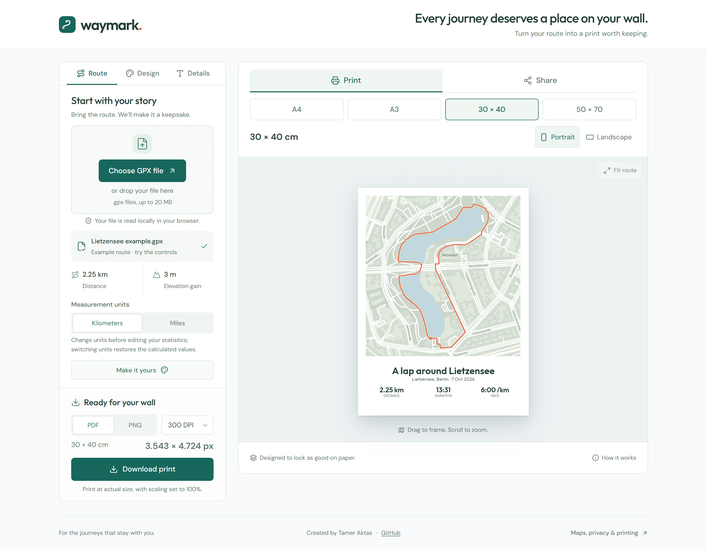
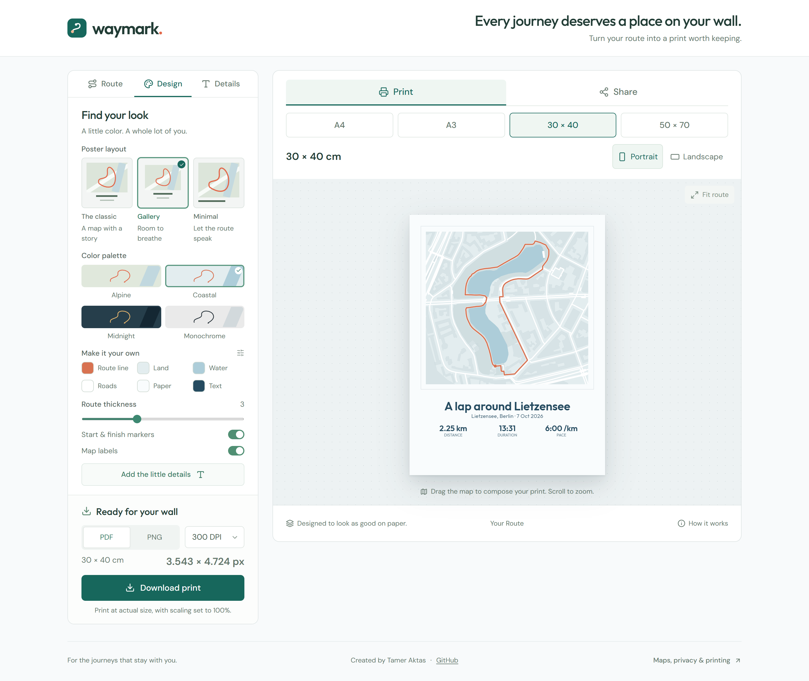
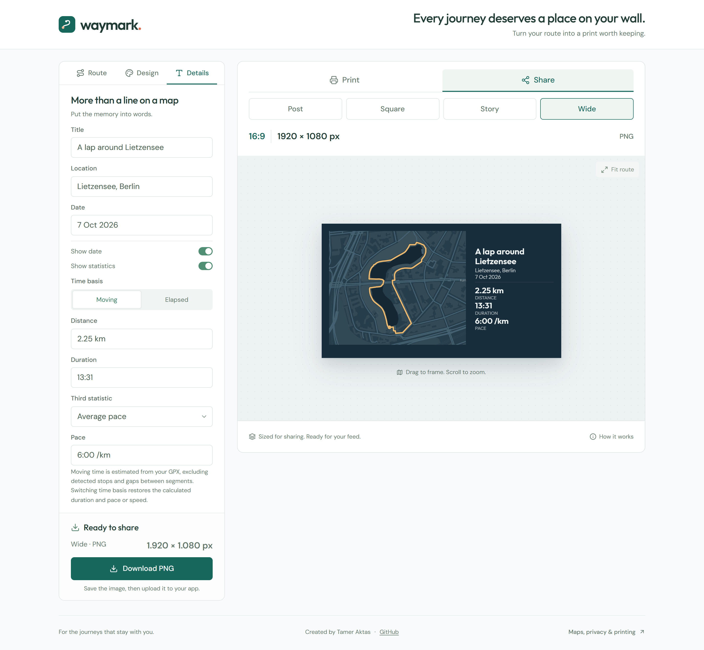
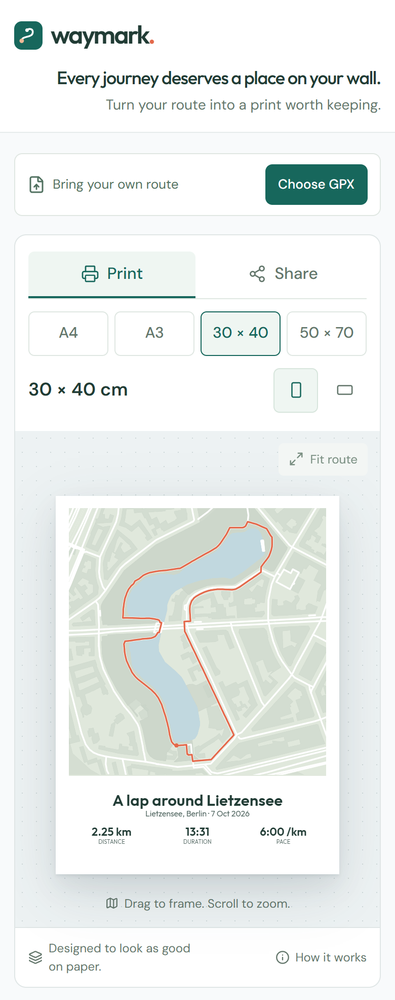

# Waymark

Turn a GPX route into a personal map print or an image to share. Waymark is a browser-based studio built with React, TypeScript, Vite, Tailwind CSS, MapLibre GL JS, and pdf-lib.



## Features

- Import a GPX file or try the built-in Lietzensee loop in Berlin.
- Choose three poster layouts and four palettes, then customize colors, route thickness, markers, and map labels.
- Edit the title, location, date, and statistics. Switch between metric and imperial units.
- Drag and zoom the map to compose your artwork, or use **Fit route**.
- Export a print-ready PNG or PDF, or a PNG sized for sharing.

No account, API key, database, or application backend is required.

## Screenshots

**Design your print.** Choose a poster layout and palette, then refine the map colors, route line, and markers. Shown here: Gallery with the Coastal palette.



**Create an image to share.** Edit your captions and statistics while previewing the selected format. Shown here: a 1920 × 1080 Wide image with the Minimal layout and Midnight palette.



**Compose on mobile.** The route upload and live preview sit above the editor controls on smaller screens.

<p align="center">
  
</p>

## Run locally

Use Node.js 22.12 or newer and npm.

```sh
npm ci
npm run dev
```

Open the local URL printed by Vite, usually `http://localhost:5173`.

| Command | Purpose |
| --- | --- |
| `npm run dev` | Start the development server |
| `npm run check` | Check TypeScript |
| `npm test` | Run the unit tests |
| `npm run build` | Build the static website into `dist/` |
| `npm run preview` | Preview the production build locally |
| `npm run test:browser` | Run the browser integration checks |
| `npm run screenshots:readme` | Refresh the screenshots used in this README |

## Create a print or sharing image

1. Choose or drop a GPX file up to 20 MB, or start with the example route.
2. Use **Design** to choose the layout, palette, and map appearance.
3. Choose metric or imperial units, then use **Details** to choose **Moving** or **Elapsed** time and edit the captions and statistics. Switching units restores the calculated statistics; switching time basis restores calculated duration and pace or speed.
4. Adjust the composition by dragging and zooming the map.
5. Choose **Print** or **Share** above the preview, select a size, and download.

**Print** supports A4, A3, 30 × 40 cm, and 50 × 70 cm, in portrait or landscape. PNG and PDF exports use 150 or 300 DPI. PDFs have the exact page dimensions and embedded fonts; PNGs include physical-resolution metadata. Print at actual size, with scaling set to 100%.

**Share** exports a PNG at the selected pixel dimensions:

| Format | Ratio | Pixels |
| --- | --- | --- |
| Instagram post | 3:4 | 1080 × 1440 |
| Square | 1:1 | 1080 × 1080 |
| Story | 9:16 | 1080 × 1920 |
| Wide | 16:9 | 1920 × 1080 |

Print settings are preserved when switching modes. Sharing images do not use print DPI or include physical-resolution metadata.

Map images are raster artwork rendered from vector tiles. PDF captions remain vector text where the font supports their characters; unsupported characters use browser-rendered fallback text. Long captions wrap or scale to fit. Previews and exports omit the map copyright line.

Large exports depend on available browser memory and graphics limits. If an export is too large, choose 150 DPI or a smaller paper size.

## Data and privacy

GPX files, edited settings, calculations, and exported artwork stay in your browser. The app has no accounts, analytics, or server uploads. Projects are held in memory and cleared on reload.

Map previews and exports require JavaScript, WebGL, and an internet connection. OpenFreeMap receives requests for the region being viewed and provides the map label fonts. Interface and poster fonts are served with the website.

GPX segments remain separate, so recording gaps do not add artificial connecting lines or distance. **Moving** time is selected by default: duration, pace, and average speed use estimated time in motion. **Elapsed** uses the full time between the first and last point, including stops and recording gaps. Duration and pace require complete, ordered timestamps; missing values can be entered manually. Imported dates are initially formatted in UTC and can be edited.

Moving time is estimated from displacement over roughly 10-second windows, counting windows at or above 1 km/h and excluding time between separate GPX segments. Sparse recordings use their actual sample intervals. GPS drift, slow movement, and pauses within a sample window can affect the result, so it may differ from the time shown by your recording app. A GPX without usable timestamps cannot supply a moving-time estimate. Manual duration and pace/speed entries remain independent.

The default example follows mapped park paths and eastern sidewalks around Lietzensee. Its geometry is stored in `src/lib/demo-route.ts` and comes from [OpenStreetMap contributors](https://www.openstreetmap.org/copyright) under ODbL 1.0. Running times and elevations are illustrative.

## Tests

Unit tests cover GPX parsing and statistics, poster geometry and text fitting, map styles, and PNG resolution metadata.

For the browser checks, use an installed Edge or Chrome through `QA_BROWSER_CHANNEL` (see below), or install Playwright's Chromium browser:

```sh
npx playwright install chromium
```

Start the development server on the address used by the browser checks:

```sh
npx vite --host 127.0.0.1 --port 5173 --strictPort
```

In another terminal, run `npm run test:browser`. The tests require internet access for real map tiles.

Set `QA_BASE_URL` to use a different server URL; the default is `http://127.0.0.1:5173`. Set `QA_BROWSER_CHANNEL` to `msedge` or `chrome` to use an installed Microsoft Edge or Google Chrome instead of Playwright's Chromium.

The browser suite covers file validation and import, editing, map styling, responsive layouts down to 320 px, and PNG/PDF downloads. It writes screenshots, exports, and reports to the ignored `test-results/` directory.

### Refresh README screenshots

With the development server running as described above and a browser available through Playwright, run:

```sh
npm run screenshots:readme
```

The script captures the built-in Lietzensee example at desktop and mobile widths, using a 2× pixel density for sharp text. It fits the complete route before each capture, waits for fonts and real map tiles, checks for runtime errors and horizontal overflow, and saves four PNGs in `docs/screenshots/`. Commit these images with the README. The script also supports `QA_BASE_URL` and `QA_BROWSER_CHANNEL` as described above.

## Project structure

- `src/components/`: editor controls, information dialog, and interactive poster preview.
- `src/lib/`: GPX parsing, map styles, shared preview/export layout, presets, and export generation.
- `src/styles/global.css`: Tailwind theme, fonts, and shared styles.
- `public/`: favicon and locally served print fonts.
- `tests/fixtures/`: synthetic GPX files for automated tests.
- `scripts/browser-qa.mjs`: browser integration checks.
- `scripts/readme-screenshots.mjs`: reproducible README screenshot capture.
- `docs/screenshots/`: committed screenshots displayed in this README.

## Deployment

Run `npm run build` and deploy `dist/` to a static host. No server application is needed.

The current configuration assumes hosting at the domain root. Hosting under a subpath such as `/waymark/` requires setting Vite's `base` before building and updating the root-relative home link and logo URL in `src/components/PrintEditor.tsx` to respect that base.

## Resources

- [MapLibre GL JS](https://maplibre.org/)
- [OpenFreeMap](https://openfreemap.org/)
- [OpenMapTiles](https://openmaptiles.org/)
- [OpenStreetMap contributors](https://www.openstreetmap.org/copyright)
- [Outfit fonts](https://github.com/Outfitio/Outfit-Fonts), licensed under the SIL Open Font License. The license is included in [public/fonts/OFL.txt](public/fonts/OFL.txt).
